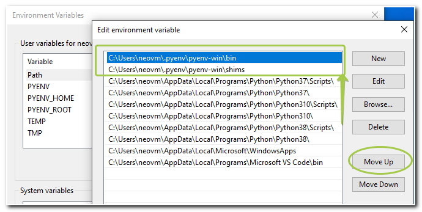
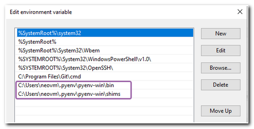
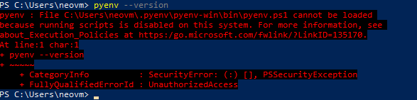

## Known Issues

- [Wrong Python version (due to PATH)](#wrong-python-version-due-to-path)
- [PowerShell Execution Policy error](#powershell-execution-policy-error)


## Wrong Python version (due to PATH)

*Author(s):* [@hotenov](https://github.com/hotenov)  
*Related issue(s):* #209

### Short description

1) **PATH order matters**
2) **System** (Machine) PATH **beats User** PATH

<details><summary>Problem in one image (click me)</summary>
<p>



</p>
</details>

### How to fix it

To check the current order of Python paths, you can run this command in shell:

```powershell
where.exe python
```

If you see both **pyenv-win**'s rows at the top of command's output - you've installed and set up pyenv-win correctly and you can use it now. Otherwise, look at two possible ways to solve your problem below.

<details><summary>Solution 1: Move Up two pyenv-win's paths</summary>
<p>

 - Open ***Advanced System Properties***:
   - Win + R and run `systempropertiesadvanced`
 - Click on ***Environment Variables..***. button
 - Select **Path** in _User variables_ table and click on **Edit...** button
 - Find and select two pyenv-win's rows and move them up clicking **Move Up** button (each row you have to move separately)
 - Click **OK** button twice and RESTART (open new) shell terminal window (terminal).

See lovely [GIF](./img/user-path-changing-order.gif) *(for understanding text instructions or lazy person :sleeping:)*

> **Another dirty way**: you can run PowerShell [command](#ps-user-path) for adding pyenv-win's paths once again.

</p>
</details>

<details><summary>Solution 2: Leave only pyenv-win's paths in System PATH</summary>
<p>

Instead of changing every time User PATH, you can add two pyenv-win's rows to **System** PATH. They can be at the bottom of the system list. BUT watch out for another paths which higher pyenv-win's paths. They could contain `python.exe`.



In any case, to be sure - restart your shell and check the order by `where.exe python` command.

</p>
</details>


### Long description

Windows detects current (active) Python interpreter from `PATH` Environment Variable. When you type `python` in your favorite shell (Terminal, CMD, PowerShell, etc.) OS searches `python.exe` in PATH records starting from the top (beginning). As soon as the interpreter is found - OS stops search and runs the executable file. That's why the order in PATH matters.

Windows has three scopes of environment variables: System (or Machine), User and Process scope. Interpreter search follows the same sequence: **System PATH -> User PATH -> Process (session) PATH**

[One picture](./img/solution-with-system-path.png) instead of thousand words.

When you set up **pyenv-win** you add two records (paths) at the top of User PATH variable by executing following PowerShell command from [Readme steps](https://github.com/pyenv-win/pyenv-win#finish-the-installation):

<a id="ps-user-path"></a>

```powershell
[System.Environment]::SetEnvironmentVariable('path', $env:USERPROFILE + "\.pyenv\pyenv-win\bin;" + $env:USERPROFILE + "\.pyenv\pyenv-win\shims;" + [System.Environment]::GetEnvironmentVariable('path', "User"),"User")
```

and everything is fine (works correctly) until you install another Python version from python.org or adds path with installed interpreter to System PATH variable. Always check you Pythons paths if something goes wrong.


## PowerShell Execution Policy error

*Author(s):* [@hotenov](https://github.com/hotenov)  
*Related issue(s):* #332

### Short description

User sees this error "*... pyenv.ps1 cannot be loaded
because running scripts is disabled on this system ...*":



### How to fix it

Run following command in PowerShell and type 'Yes' for its confirmation.

```powershell
Set-ExecutionPolicy -ExecutionPolicy RemoteSigned -Scope CurrentUser
```

### Long description
By default PowerShell forbids to run any script file (`.ps1`) due to ***Default*** Execution Policy. You can change it on less restricted policy at any time.

Reed more about policy types and scopes on [Microsoft Documentation](https://go.microsoft.com/fwlink/?LinkID=135170) website.
